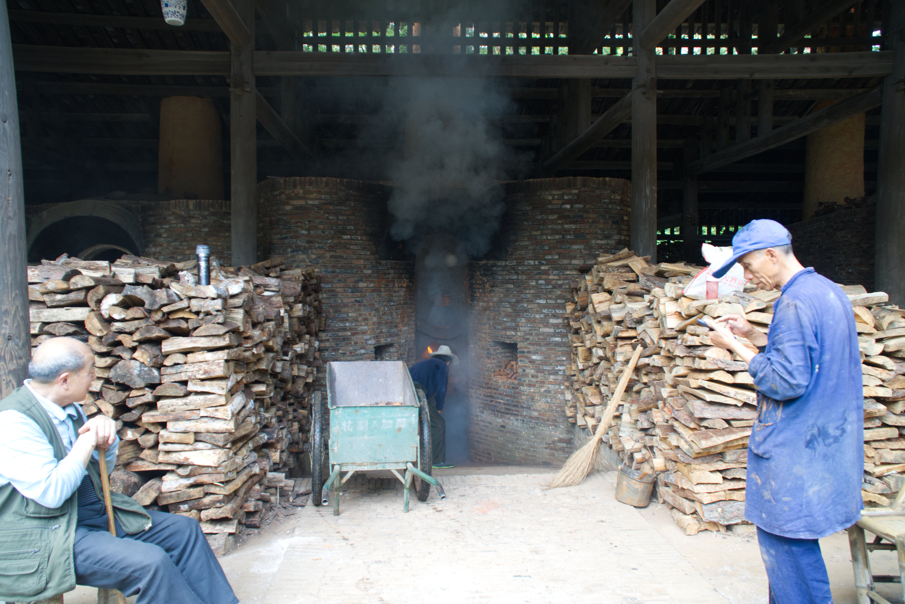
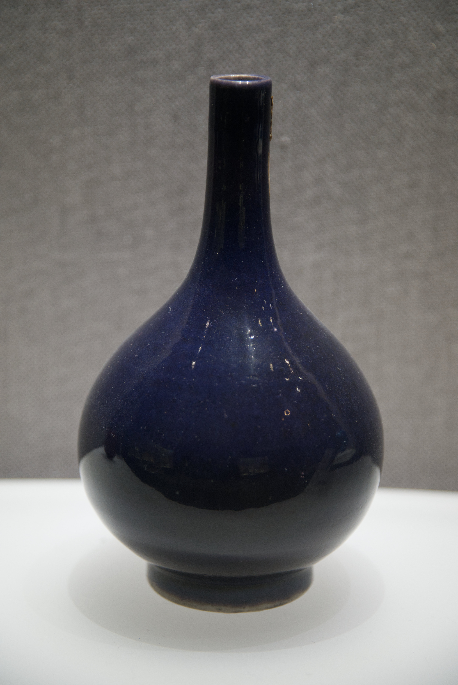

# Citywalk: 景德镇，窑火里凝固的深蓝

> 📍 **路线坐标**：江西·景德镇·古窑民俗博览区
> ⏱ **时间**：午后至黄昏
> 🏷 **关键词**：#景德镇 #古窑 #祭蓝 #手工 #非遗

## 01 入口：松脂与干燥的尘土

到达古窑的时候，并不是什么清晨，而是太阳最烈的中午。

和那些被小红书滤镜包裹的“网红打卡点”不同，这里的空气里有一种非常实在的、甚至有些呛人的味道。那是松木燃烧后的焦香，混合着成吨堆积的干燥泥土气息。这不是书本上写的“文化气息”，而是某种更原始的、属于火与土的物理反应。

避开了喧闹的旅行团大巴，我从侧边的小径切入。这里没有过多的装饰，脚下是那种被无数人踩得发亮的青砖路。两旁的树木被某种热浪熏蒸得有些甚至，叶片上落了一层薄薄的窑灰。

这里不像是一个景区，更像是一个还在运转的巨大心脏。你能听到远处传来沉闷的“嗡嗡”声，那是火焰在炉膛里吞噬空气的声音。这种声音让人莫名的心安，仿佛穿越回了那个“工匠八方来，器成天下走”的嘈杂年代。我调整了一下呼吸，让那股带有松脂味的空气充满肺部，准备走进这场关于火的叙事。

## 02 漫步：在满地松柴间穿行

深入厂区，视觉瞬间被两种颜色占据：红砖的赭红，和松柴的金黄。

眼前是一座正在工作的镇窑（Zhen Kiln）。照片里的场景就在我眼前活了起来。

巨大的窑体像一只卧倒的巨蛋，覆盖着厚重的红砖。最让人震撼的不是建筑本身，而是堆积如山的松木。这些松柴被劈得整整齐齐，像城墙一样围在窑炉四周。

几个穿着蓝色工装的师傅正坐在那一堆乱中有序的木料旁。他们并没有我想象中那种“大师”的端着架子，其中一位正趁着添柴的间隙，低头看着手机，屏幕的光照亮了他沾满烟灰的脸庞。这种反差感极强——背后是延续了千年的传统柴烧技艺，手里是连接世界的现代科技。

我走近了一些，热浪扑面而来。地上散落着碎木屑和断裂的窑砖。我蹲下来，手指触碰到一块废弃的匣钵碎片，粗糙、干涩，表面还带着高温烧结后的颗粒感。这就是瓷器的“母体”，在它们成为光鲜亮丽的艺术品之前，都要经过这样粗粝、甚至有些暴力的火的洗礼。

旁边的一位老师傅刚刚完成了一轮投柴，他站起身，拍了拍手上的木屑。他的动作不急不缓，眼神里有一种只有常年与火打交道的人才有的淡定。这里没有精密温控的仪表盘，全靠这双眼，这双手，去感知那1300度的烈焰。

## 03 纹理：凝固的夜色

穿过燥热的作坊区，走进陈列室，世界瞬间安静并冷却下来。

在众多繁复的粉彩和青花中，我的目光被一只单色釉瓶子死死抓住了。

那是一抹深邃的蓝，学名叫“祭蓝”（Ji Lan）。

如果说外面的窑炉是火的躁动，那么这只瓶子就是火的寂静。

我凑近细看，甚至不敢呼吸太重。它的釉面不是那种浮躁的贼光，而是一种厚重、沉稳的质感，像极了雨后深夜的天空，又像是深不见底的湖水。那种蓝，蓝得纯粹，蓝得让人想哭。釉层极其肥厚，表面没有一点气泡和橘皮纹，手指虚空抚摸过去，仿佛能感受到那种温润如玉的触感。

这就是高温颜色釉的魅力。在1280度以上的高温中，钴料融化、流淌，最后在冷却的那一瞬间，将流动的液体凝固成了永恒的固体。它不需要任何画笔的勾勒，不需要任何花纹的修饰，单单是这颜色本身，就足够有力。它静静地立在那里，把刚才外面那喧嚣的松木爆裂声、工匠的汗水、烈火的咆哮，全部吞没，转化成了这无言的深蓝。

## 04 历史切片：把桩师傅的眼睛

在这个AI和自动化统治的时代，景德镇的古窑依然保留着最“笨”的技艺。

这里就要提到一个核心的角色——“把桩”。在柴窑的烧制过程中，没有任何温度计可以插入那几米深的窑膛。所有的成败，全系于把桩师傅的一双眼睛。

**Knowledge Point**：
镇窑（Zhen Kiln）是景德镇特有的蛋形瓷窑，也是目前世界上现存最古老的柴烧瓷窑。它的热效率极高，但控制难度极大。把桩师傅需要通过观察火焰的颜色——从暗红到橘红，再到刺眼的白炽色，来判断窑内的温度，误差不能超过10度。同时，他还要往窑里吐一口唾沫，看唾沫蒸发的速度来判断湿度和气流。

看着刚才那位看手机的师傅，我突然意识到，他可能就是正在传承这项绝技的人。他看的不是手机，或许是在等待下一个“火候”的到来。这种技艺无法通过数据传输，只能通过口传心授，通过无数个日夜的烟熏火燎，刻写在肌肉记忆里。每一件完美的祭蓝背后，都有无数次把桩师傅在生死线上的博弈。

## 05 离去：带不走的烟火气

走出古窑的时候，夕阳已经斜挂在烟囱梢头。

身上的衣服吸饱了松木燃烧的味道，这是一种很特别的香水，比任何大牌都要持久。我回头望了一眼那红砖砌成的巨大烟囱，青白色的烟雾正袅袅升起，融入景德镇灰蓝色的暮霭中。

这次Citywalk，我没有买任何瓷器。因为我觉得，最好的瓷器其实已经留在了我的感官里：是入口处那呛人的松脂味，是手指触碰粗糙匣钵的触感，是那只祭蓝瓶子深邃的凝视，也是那位工匠在火光中低头看手机的剪影。

瓷器是泥土做的，但灵魂是火给的。而火，是人点的。

景德镇的魅力，不在于店里摆着多少精致的茶杯，而在于这座城市本身，就是一座还在燃烧的巨大的窑。我们都是路过的旅人，带不走这里的火，但可以带走被火照亮的那一瞬间的感动。

---
*注：本文基于真实游览体验创作，图片来源于实地拍摄。*
